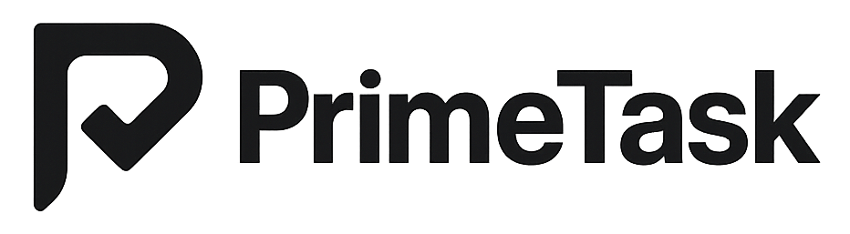

<p align="center">
  
</p>

# PrimeTask for Obsidian

Built on a deliberate idea: [PrimeTask](https://primetask.app) stays your task and project tool, and Obsidian stays where your thinking happens. The plugin connects the two without trying to turn either into the other.

The flow most people use day to day is the simplest one. You are writing in a note, you have an idea worth doing, you select the sentence, right-click, and **Send selection to PrimeTask and link here**. The selected text becomes a `[[wikilink]]` to a new task note, the task is born inside PrimeTask, and the task carries a permanent backlink to the note that produced it. You can always trace any task back to the thought it came from.

> Free companion plugin. Requires the PrimeTask desktop app running on the same machine. macOS or Windows.

## How this is different

Most Obsidian task plugins try to make Obsidian into a task manager. This one does the opposite. PrimeTask remains your execution layer (Focus Mode, Gantt, Kanban board, CRM, time tracking, recurring tasks, reports). Obsidian stays your capture and context layer, where ideas are born and notes accumulate around them.

This is why:

- The marquee flow is **note to task**, not the other way. There is no "push every task into the vault" button, and no way to start a promote from inside PrimeTask itself — that would invert the design.
- Task notes are **graph nodes**, not checkbox lines. Every promoted task is its own `.md` file with rich frontmatter (status, priority, due date, progress) so Bases and Dataview can query your vault as a personal task database.
- The vault stays clean by default. Nothing is auto-mirrored. Promotion is always explicit and user-initiated.
- Every task remembers where it came from, with `origin: [[Source Note]]` in its frontmatter and a `Captured from [[Source Note]]` line in the body.

## What it does

- **Capture from selection** (the primary flow). Select text inside any note, right-click, and choose **Send selection to PrimeTask and link here** (replaces the selection with a wikilink to a new task note) or **Send selection to PrimeTask** (creates the task without modifying your note).
- **Convert existing notes.** Right-click anywhere in a note with no selection and choose **Convert note to PrimeTask task** or **Convert note to PrimeTask project**. The note's H1 becomes the title, the body becomes the description, and the file stays exactly where it is.
- **Live sidebar** showing every task and project in your locked PrimeTask space, with status, priority, due date, and progress inline. Inline pills for quick edits. Right-click any row to promote it into a note when you want one.
- **Two-way sync on task Properties.** Status, priority, due date, progress, description, and the `done` checkbox all round-trip between Obsidian and PrimeTask.
- **Project dashboards as notes.** Promoted project notes carry typed Properties (progress, health, task counts, overdue count, deadline, start date, archive state) that match the PrimeTask dashboard exactly and let you filter and sort in Bases.
- **Nothing auto-pushed.** Task and project notes only appear when you explicitly promote them. The plugin stays out of your vault until you invite it in.

## Requirements

- Obsidian 1.12 or newer.
- PrimeTask desktop app (macOS or Windows) installed and running on the same machine.
- **External Integrations** enabled in PrimeTask → Settings.

Desktop-only. Obsidian Mobile is not supported because the plugin talks to the PrimeTask desktop app on a local port.

## Install

The plugin is currently in private beta. It is not yet published to the Obsidian Community Plugins store.

Beta testers install manually:

1. Download the latest release from the Releases page.
2. Unzip into `<your-vault>/.obsidian/plugins/primetask-sync/`.
3. Enable the plugin under Settings → Community plugins.
4. Follow the in-app setup guide (authorize, lock a space, enable the mirror).

After install, a full manual regenerates inside your vault at `PrimeTask/PrimeTask for Obsidian.md` on the first sync.

Official setup and troubleshooting guide:

- https://www.primetask.app/docs/integrations/obsidian-integration

## Privacy and security

- **All traffic is local.** The plugin talks to the PrimeTask app over `127.0.0.1`. Nothing crosses the public internet.
- **No telemetry.** The plugin collects nothing. It calls only the PrimeTask app.
- **Explicit authorization.** You approve the plugin once from inside the PrimeTask app with a 6-character code comparison. Revoke any time.
- **Official build recognition.** Official PrimeTask releases are recognized by PrimeTask during authorization. Modified or unofficial builds may appear as unrecognized in the authorization dialog.
- **Per-plugin kill switch.** Pause the plugin without revoking from PrimeTask's Connected Plugins UI.

## Development

```bash
# Install deps
npm install

# Symlink (or copy) this folder into a test vault:
#   <vault>/.obsidian/plugins/primetask-sync
ln -s "$(pwd)" "/path/to/vault/.obsidian/plugins/primetask-sync"

# Dev build (watches for changes)
npm run dev

# Production build
npm run build
```

Open the test vault in Obsidian, enable the plugin under Settings → Community plugins, and iterate. Reload Obsidian with `Cmd+R` to pick up rebuilds.

### Build recognition

Official PrimeTask releases are recognized by PrimeTask during authorization. Local or modified builds may appear as unrecognized during authorization.

For regular users, the important rule is simple: install official releases and only approve builds you trust.

## Roadmap

Shipped:

- Live sidebar (tasks, projects, subtasks).
- Task / subtask / project promotion from sidebar + selection + whole-note conversion.
- Two-way task Properties sync.
- Project note dashboards with auto-refreshing "Promoted tasks" section.
- Per-plugin pause toggle on the PrimeTask side.

Coming in v0.2:

- Milestones and goals mirroring (opt-in promote flow).
- Small polish informed by beta feedback.

Later:

- CRM (contacts, companies, activities) mirroring. Requires PrimeTask Pro.
- Bidirectional tag sync (Obsidian → PrimeTask).
- Bases starter views.

## License

[Apache-2.0](./LICENSE)
